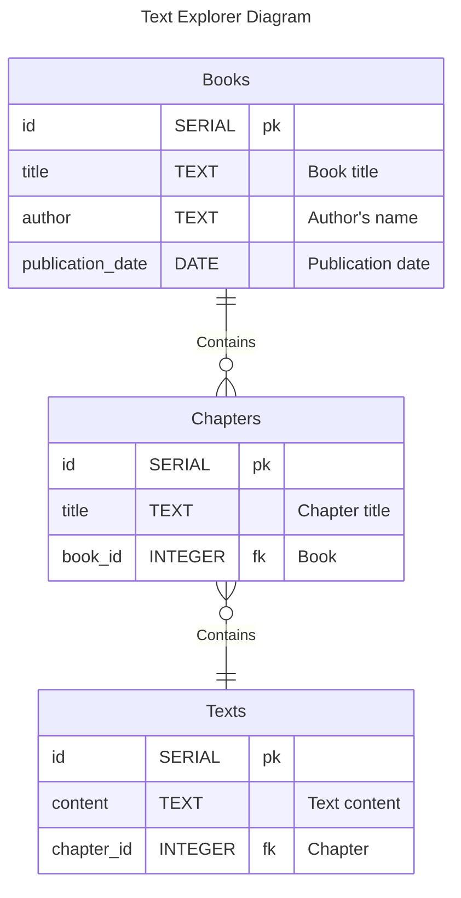

# My Project: Text Insights Explorer

An application designed for retrieving text from Gutenberg books.

## Data source

- [Pride and Prejudice](https://www.gutenberg.org/ebooks/1342) by Jane Austen

## Items of interest

- Chapters
- Character dialogues
- Themes and motifs

## Proposed layout

## ER Diagrams

